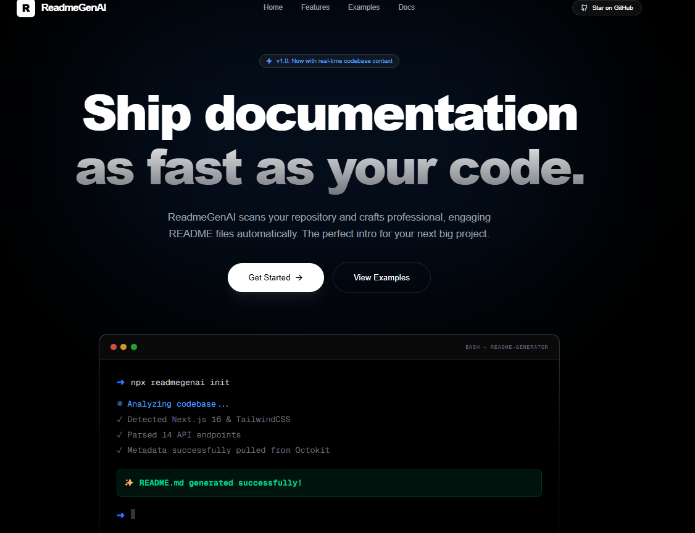
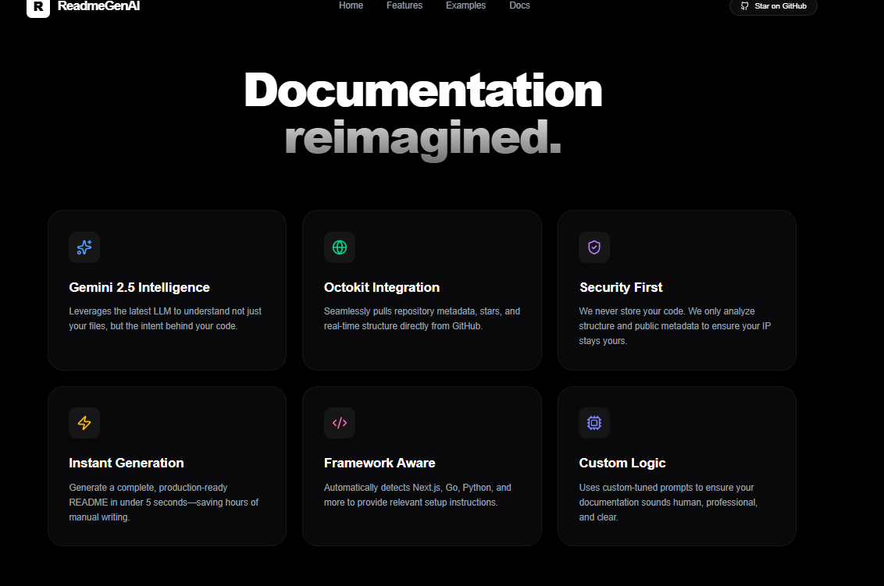

<h1 align="center">ReadmeGenAI</h1>
<p align="center">
  <strong>Instantly generate professional, well-structured README files for your GitHub repositories with AI-powered precision.</strong>
</p>

<p align="center">
  
  
  
  
  
  
</p>

---

## The Strategic "Why"

> The challenge of maintaining high-quality, consistent documentation across multiple projects often leads to neglected or poorly structured READMEs. Developers spend valuable time on boilerplate content, detracting from core development, and project adoption suffers due to unclear or incomplete initial information.

ReadmeGenAI eliminates this friction by leveraging advanced AI to automatically generate comprehensive, professional README files. This empowers developers to focus on writing code, ensures every project starts with excellent documentation, and drastically improves discoverability and user onboarding without manual effort.

## Key Features

- 🚀 **Instant Generation**: Create a complete, professional README in seconds, not hours.
- ✨ **AI-Powered Quality**: Benefit from intelligently structured and contextually relevant content, ensuring high standards.
- ⚙️ **Customizable Output**: Tailor generated READMEs to specific project requirements and branding guidelines.
- 💾 **Standard Markdown**: Output is always clean, industry-standard Markdown, ready for GitHub and other platforms.
- ⏱️ **Time-Saving Workflow**: Reclaim development time by automating a crucial, often tedious, documentation step.
- 🌐 **Open-Source & Extensible**: A community-driven project that welcomes contributions and further innovation.

<p align="center">
  
  <br>
  <br>
  
</p>

## Technical Architecture

ReadmeGenAI is built on a robust, modern web stack designed for performance, scalability, and developer experience.

### Tech Stack

| Technology        | Purpose                              | Key Benefit                                   |
| :---------------- | :----------------------------------- | :-------------------------------------------- |
| **Node.js**       | Server-side JavaScript runtime       | High performance, extensive package ecosystem |
| **TypeScript**    | Primary programming language         | Type safety, improved code maintainability    |
| **Next.js**       | React framework for web applications | SSR, SSG, API routes, optimized performance   |
| **ESLint**        | Pluggable JavaScript linter          | Code quality, consistency, error prevention   |
| **PostCSS**       | CSS pre-processor                    | Enhanced CSS capabilities, modular styling    |
| **Coderabbit.ai** | AI-powered code review integration   | Automated feedback, improved code quality     |

### Directory Structure

```
ReadmeGenAI/
├── .coderabbit.yaml
├── .github/
├── .gitignore
├── CODE_OF_CONDUCT.md
├── LICENSE
├── README.md
├── eslint.config.mjs
├── next.config.ts
├── package-lock.json
├── package.json
├── postcss.config.mjs
├── public/
├── src/
└── tsconfig.json
```

## Operational Setup

Follow these steps to get ReadmeGenAI up and running on your local machine.

### Prerequisites

Ensure you have the following installed:

- **Node.js** (LTS version recommended)
- **npm**, **yarn**, or **pnpm** (package manager)

### Installation

1.  **Clone the repository**:

    ```bash
    git clone https://github.com/your-org/ReadmeGenAI.git
    cd ReadmeGenAI
    ```

2.  **Install dependencies**:

    ```bash
    npm install
    # or yarn install
    # or pnpm install
    ```

3.  **Run the development server**:
    ```bash
    npm run dev
    # or yarn dev
    # or pnpm dev
    ```
    Open [http://localhost:3000](http://localhost:3000) in your browser to see the application.

### Environment Configuration

This project may utilize environment variables for API keys or other sensitive configurations.
While not explicitly in the root, Next.js applications commonly use `.env.local`.

Create a `.env.local` file in the root of the project if required, following any examples provided (e.g., `.env.example`).
Example:

```
# .env.local
NEXT_PUBLIC_AI_API_KEY=your_ai_api_key_here
```

## Community & Governance

ReadmeGenAI thrives on community contributions and open collaboration.

### Contributing

We welcome contributions from everyone! To contribute to ReadmeGenAI:

1.  **Fork** the repository.
2.  **Create a new branch** for your feature or bug fix: `git checkout -b feature/your-feature-name`
3.  **Commit your changes** with a clear and descriptive message.
4.  **Push your branch** to your fork.
5.  **Open a Pull Request** against the `main` branch of this repository.

Please ensure your code adheres to our coding standards and passes all tests. Refer to our [CODE_OF_CONDUCT.md](CODE_OF_CONDUCT.md) for community guidelines.

### License

This project is licensed under the **MIT License**.

The MIT License is a permissive free software license, meaning you are free to:

- **Use**: Employ the software for any purpose.
- **Modify**: Change the software to suit your needs.
- **Distribute**: Share copies of the software.
- **Sublicense**: Grant others the right to use, modify, and distribute the software.
- **Private Use**: Use the software privately.

The only conditions are that the license and copyright notice must be included in all copies or substantial portions of the software. The license explicitly states "THE SOFTWARE IS PROVIDED 'AS IS'", meaning there is no warranty of any kind.

For the full license text, please see the [LICENSE](LICENSE) file.
